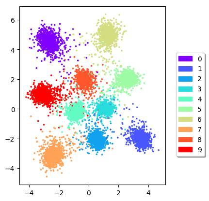

# Triplet Loss for Person Re-Identification

- TensorFlow implementation of person re-identification using triplet loss described in [
In Defense of the Triplet Loss for Person Re-Identification
](https://arxiv.org/abs/1703.07737).
- Batch hard mining is used during training.

## Requirments
- Python 3.0
- TensorFlow 1.12.0+ 

## Metric Learning on MNIST
- Test on MNIST dataset to check if the triplet loss using batch hard mining correctly implemented.
- The dimention of embedding is set to be 2 for visualization.
- As MNIST dataset is pretty simple, the network used to learn the embedding consists of 2 convolutional layers followed by 2 fully connect layers, which is defined **here**.
- For each batch, 12 samples of each class (0-9) are randomly selected. For triplet loss, margin = 0.5 is used.
- Here is the learned embedding of testing set after training for 50 epochs with learning rate 1e-4: 


### Train embedding of MNIST by yourself
#### Setup path
- All the pathes are setup in [`experiment\config.py`](experiment\config.py).
- `mnist_dir` - directory of mnist data set.
- `mnist_save_path` - directory of saving results.

#### Train
Go to `experiment`, run

 ```
 python main.py --train --lr 1e-4 --embed EMBEDDING_DIM --margin MARGIN_VAL
 ```
 
- `--embed` is for dimension of embedding and `--margin` is for margin value of triplet loss
- If dimension of embedding is 2, the embedding visualization images will be saved in `mnist_save_path` at each epoch.

## Person Re-Identification on [MARS](http://www.liangzheng.com.cn/Project/project_mars.html) dataset
- The network for learning embedding is the same as LuNet described in [
In Defense of the Triplet Loss for Person Re-Identification
](https://arxiv.org/abs/1703.07737).
- Images are rescaled to 128 x 64 and normalized to [0, 1] before fed into the network.
- Batch size is 128 (randomly pick 32 tracklet with 4 images each). For triplet loss, margin = 0.5 is used.
- Here is the training-log for 25000 training iteration. The initial learning rate


## Reference code
- [https://github.com/omoindrot/tensorflow-triplet-loss](https://github.com/omoindrot/tensorflow-triplet-loss)

## Author 
Qian Ge